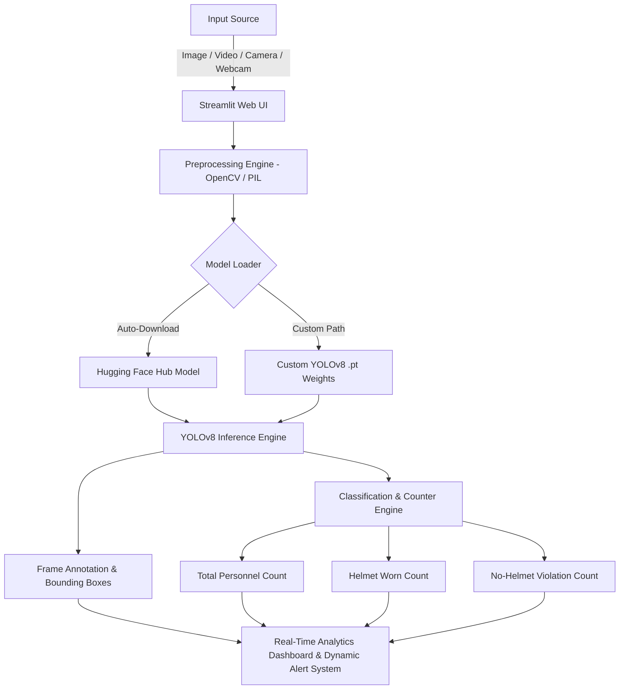

# ⛑️ NTPC Helmet Detection System

[](https://www.python.org/)
[](https://streamlit.io/)
[](https://docs.ultralytics.com/)
[](https://huggingface.co/)
[](https://github.com/astral-sh/uv)

An AI-powered Safety Compliance & Helmet Detection System designed for industrial monitoring (such as power plants and construction sites). Built using **Streamlit**, **YOLOv8**, and **OpenCV**, this web application identifies personnel in real-time, monitors safety gear compliance, calculates live analytics, and triggers visual violation alerts.

---

## 📑 Table of Contents

- [Overview](#-overview)
- [Key Features](#-key-features)
- [System Architecture](#-system-architecture)
- [Project Structure](#-project-structure)
- [Prerequisites](#-prerequisites)
- [Installation & Setup](#-installation--setup)
- [Usage Guide](#-usage-guide)
  - [Image Mode](#1-image-mode)
  - [Video Mode](#2-video-mode)
  - [Camera Snapshot Mode](#3-camera-snapshot-mode)
  - [Live Webcam Feed](#4-live-webcam-feed)
- [Detection Engine & Logic](#-detection-engine--logic)
- [Model Details](#-model-details)
- [Troubleshooting & FAQ](#-troubleshooting--faq)
- [Roadmap & Future Scope](#-roadmap--future-scope)

---

## 🌟 Overview

Ensuring worker safety and compliance with Personal Protective Equipment (PPE) standard requirements (specifically safety hard-hats/helmets) is vital in high-risk industrial environments like NTPC power plants, sub-stations, and construction projects. 

This repository provides an automated Computer Vision solution that:
1. Detects personnel in image, video, snapshot, and live webcam feeds.
2. Identifies whether each individual is wearing a protective hard-hat/helmet.
3. Computes real-time statistics (Total People, Wearing Helmet, Non-Compliant/Not Wearing Helmet).
4. Displays dynamic visual HUD dashboards and non-blocking floating alert popups upon detecting safety violations.

---

## ✨ Key Features

- **Multi-Stream Input Processing**:
  - 🖼️ **Image Analysis**: Upload `JPG`, `JPEG`, `PNG`, `BMP`, or `WEBP` images for quick compliance checks.
  - 🎥 **Video Stream Analysis**: Process uploaded `MP4`, `AVI`, `MOV`, or `MKV` videos frame-by-frame with interactive progress tracking.
  - 📸 **Camera Snapshot**: Capture photos instantly using standard browser camera input.
  - 📹 **Live Webcam Feed**: Continuous, real-time live video processing using OpenCV.

- **Automated Model Hub Integration**:
  - Automatically fetches specialized pre-trained YOLOv8 hard-hat detection weights from Hugging Face (`keremberke/yolov8*-hard-hat-detection`).
  - Supports model sizes: **Nano** (fastest), **Small** (balanced), and **Medium** (highest accuracy).
  - Caches model weights locally (`@st.cache_resource`) for fast subsequent application boots.
  - Support for **Custom `.pt` YOLOv8 Weights** trained on custom industrial datasets.

- **Real-Time Analytics & UI Dashboard**:
  - **Dynamic Statistics Panel**: Real-time counter metrics highlighting total personnel, compliant workers, and safety violations.
  - **Status Banners**: Color-coded banners (Green for 100% compliance, Red for safety violations, Gray for clear scenes).
  - **Floating Alert Popups**: Embedded HTML/JS notification widget with automated toast notifications and client-side dismissal cooldown timers.
  - **Adjustable Sensitivity**: Live confidence threshold slider (0.1 to 1.0) for threshold tuning.

---

## 🏗️ System Architecture



---

## 📁 Project Structure

```
E:\NTPC_Helmet_Detection\
├── main.py              # Main Streamlit web application & entry point
├── main_claude.py       # Alternate / reference app implementation
├── import_model.py      # Utility script to test model instantiation
├── chec.py              # Helper script to inspect YOLO model class labels
├── yolov8n.pt           # Standard COCO pretrained YOLOv8 nano model weights
├── pyproject.toml       # Project metadata & dependency definitions
├── uv.lock              # Locked dependencies for reproducible builds
├── .gitignore           # Git ignore configuration
└── README.md            # Comprehensive project documentation
```

---

## ⚙️ Prerequisites

- **Python**: `3.13+` (compatible with `3.10+`)
- **Package Manager**: Recommended [`uv`](https://github.com/astral-sh/uv) or standard `pip`
- **Webcam**: Required only if utilizing the Live Webcam Feed mode

---

## 🚀 Installation & Setup

### Option 1: Using `uv` (Recommended & Fast)

1. **Clone the Repository**:
   ```bash
   git clone https://github.com/your-username/NTPC_Helmet_Detection.git
   cd NTPC_Helmet_Detection
   ```

2. **Sync / Install Dependencies**:
   ```bash
   uv sync
   ```

3. **Launch the Application**:
   ```bash
   uv run streamlit run main.py
   ```

---

### Option 2: Using Standard `pip` and Virtual Environment

1. **Create and Activate Virtual Environment**:
   ```bash
   # Windows (PowerShell)
   python -m venv .venv
   .\.venv\Scripts\Activate.ps1

   # Linux / macOS
   python3 -m venv .venv
   source .venv/bin/activate
   ```

2. **Install Required Packages**:
   ```bash
   pip install streamlit ultralytics opencv-python-headless pillow numpy huggingface_hub
   ```

3. **Run Streamlit App**:
   ```bash
   streamlit run main.py
   ```

---

## 📖 Usage Guide

Once the Streamlit server starts, open your browser at `http://localhost:8501`.

### 1. Sidebar Configuration
- **Select Model Source**:
  - `Pretrained hard-hat model (auto-download)`: Choose between Nano, Small, or Medium size.
  - `Custom model path`: Enter the file path to your custom-trained YOLOv8 `.pt` file.
- **Confidence Threshold**: Drag slider to adjust sensitivity (Default: `0.40`).
- **Input Source**: Select from Image, Video, Camera, or Live Webcam.

### 2. Input Modes

#### 🖼️ Image Mode
- Upload any image containing industrial workers.
- The model detects helmets, draws bounding boxes, updates the statistics panel, and displays violation warnings if any unhelmeted personnel are spotted.

#### 🎥 Video Mode
- Upload a recorded video snippet.
- Click **Start Detection**.
- Watch real-time frame processing with progress indicators, dynamic stats updating per frame, and live safety alerts.

#### 📸 Camera Snapshot Mode
- Use browser-integrated web camera to snap a photo.
- Analyzes snapshot instantly upon capture.

#### 📹 Live Webcam Feed
- Toggle **Start Live Webcam Feed**.
- Streams continuous webcam input directly through OpenCV, running frame-by-frame inference and triggering real-time toasts and modal warning cards during violations.

---

## 🧠 Detection Engine & Logic

The custom detection evaluation pipeline (`annotate_frame` function in [`main.py`](file:///E:/NTPC_Helmet_Detection/main.py#L88-L148)) implements robust multi-class parsing:

- **Positive Classes** (`Hardhat`, `Helmet`, `Safety_Helmet`): Counted as compliant personnel.
- **Negative Classes** (`NO-Hardhat`, `without helmet`, `bare`, `no helmet`): Counted as non-compliant safety violations.
- **Person / Worker Classes**: Fallback matching to compute total people when bounding boxes overlap or when analyzing generic person classes.
- **Dynamic Stats Calculation**: Automatically reconciles helmet count and no-helmet count to provide accurate personnel statistics.

---

## 📊 Pre-trained Model Options

The app integrates with top-performing hard-hat detection repositories from Hugging Face Hub:

| Model Variant | Base Architecture | Hugging Face Repository | Ideal Use Case |
| :--- | :--- | :--- | :--- |
| **Nano** | YOLOv8n | `keremberke/yolov8n-hard-hat-detection` | Edge devices, low-resource CPUs, high FPS |
| **Small** | YOLOv8s | `keremberke/yolov8s-hard-hat-detection` | Balanced speed & accuracy for live feeds |
| **Medium** | YOLOv8m | `keremberke/yolov8m-hard-hat-detection` | High-resolution static image & video auditing |

> ⚠️ **Note**: Standard COCO `yolov8n.pt` only contains generic object classes (e.g. `person`, `car`) and does **not** include hardhat/helmet classes. For helmet detection, always use the automated HuggingFace models or your own custom-trained model.

---

## ❓ Troubleshooting & FAQ

<details>
<summary><b>Q: Web Camera fails to connect in Live Webcam mode</b></summary>
<br>

- Ensure no other application (e.g. Zoom, Teams, Skype) is currently using the camera.
- If using an external USB camera, check OpenCV index (default is `0`, adjust `cv2.VideoCapture(0)` in [`main.py`](file:///E:/NTPC_Helmet_Detection/main.py#L579) to `1` or `2` if multiple cameras are attached).
</details>

<details>
<summary><b>Q: HuggingFace model download fails or times out</b></summary>
<br>

- Verify your internet connectivity.
- Alternatively, download `best.pt` manually from [HuggingFace keremberke/yolov8n-hard-hat-detection](https://huggingface.co/keremberke/yolov8n-hard-hat-detection) and select **Custom model path** in the sidebar.
</details>

<details>
<summary><b>Q: Low Detection Accuracy or False Positives</b></summary>
<br>

- Try adjusting the **Confidence Threshold** slider in the sidebar. Lower values (e.g. `0.25`) increase detection recall in dark/shadowy environments, while higher values (e.g. `0.60`) reduce false positives.
- Switch from **Nano** to **Medium** model size for better accuracy.
</details>

---

## 🔮 Roadmap & Future Scope

- [ ] **Email & SMS Violation Alerts**: Automatically notify safety managers when violations persist.
- [ ] **Automated Report Generation**: Export daily/weekly PDF & Excel safety compliance reports with timestamps.
- [ ] **RTSP CCTV Stream Support**: Multi-camera industrial IP camera integration.
- [ ] **Multi-PPE Detection**: Extend support to safety vests, gloves, goggles, and safety boots.

